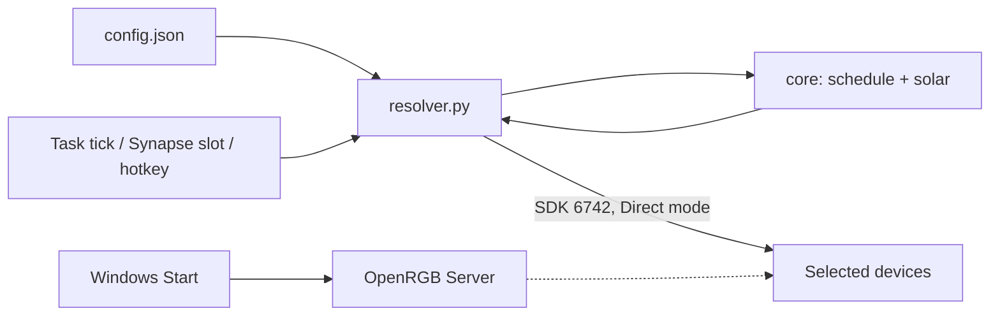

# CLAUDE.md — Ultra Vivid

Project-specific guidance for Claude Code. **Inherits ALL rules from the
monorepo root [CLAUDE.md](../../CLAUDE.md)** (mandatory workflow, Priorities,
Rules #1–#18, markdown guidelines, build pipeline, py-spy profiling) — read
that first; only project facts and deltas live here.

---

## Project Facts

- **Product:** rule-based RGB scheduling. Color presets are applied to a
  user-selected subset of OpenRGB devices by ONE schedule grouping (hours /
  weekdays / monthdays / months / solar daylight) plus keyboard shortcuts.
  **Compute, don't generate (root Rule #19):** no `.orp` profiles, no
  per-combination scripts — `resolver.py` computes the color for any moment.
- **Stack:** Python 3.13 (`openrgb-python` SDK client, `astral` solar math —
  same library/convention as DOMY Watch), two Task Scheduler tasks
  (`Ultra Vivid resolver`: log on + resume + 10-min tick; `Ultra Vivid
  daemon`: resident, hotkeys + Chroma), PySide6 GUI (`python -m gui.app`).
  OpenRGB runs as SDK server from Startup.
- **Config-driven:** everything lives in `config.json` schema v2 (Rule #4);
  `core/settings.py` validates loudly and refuses old-schema configs.
- **Synapse boundary (researched 2026-07-22):** Razer Synapse bindings have
  NO automation API and Hypershift never reaches the OS — hence the stable
  `shortcuts/slot-*.vbs` contract (bind LAUNCH once, re-map via config).
  Razer keyboard lighting IS programmable via Chroma REST API (Phase 3
  optional module).

## Data Flow

## Project Deltas to the Root Rules

- **Folder docs use `__index.md`** (double underscore) inside each folder, not
  the root's `___folder.md`. Generated files (`.vbs`, `.bat`) get no individual
  doc — they are described in the folder's `__index.md`. Script files
  (`.ps1`, `.py`) get a `.md` beside them.
- **Commit format uses a conventional-commit type:**
  `MAJOR.MINOR.NNN type(scope): description` (e.g.
  `0.1.040 feat(gui): keyboard shortcuts`, `0.1.030 fix(gui): ...`). Patch is
  zero-padded to 3 digits and increments by 10 per commit; the version lives in
  `version.py` (single source of truth, updated before committing, read by
  `setup/build.py`).
- Communicate in Serbian (Latin); everything in files stays English.

## Key Documentation

- [README.md](README.md) — overview, usage, technical documentation
- Engine: `core/__index.md` (settings, schedule, solar, apply, actions, tasks, paths, locations, chroma, keymap), `resolver.md`, `hotkey_daemon.md`, `shortcuts/__index.md`
- GUI: `gui/__index.md` (PySide6 control panel, `python -m gui.app`)
