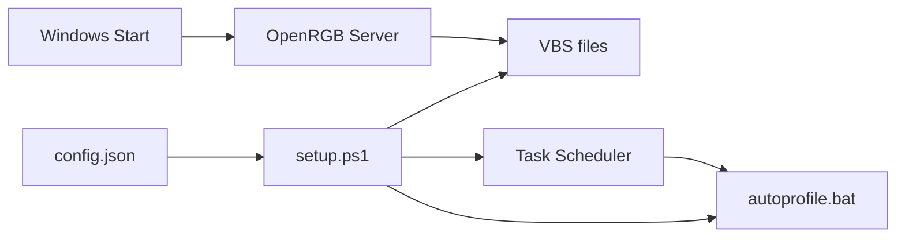

# CLAUDE.md — Ultra Vivid

Project-specific guidance for Claude Code. **Inherits ALL rules from the
monorepo root [CLAUDE.md](../../CLAUDE.md)** (mandatory workflow, Priorities,
Rules #1–#18, markdown guidelines, build pipeline, py-spy profiling) — read
that first; only project facts and deltas live here.

---

## Project Facts

- **Product:** automatic RGB lighting profile switching based on time of day.
  Reads a config defining profiles per time slot (dawn, morning, day, evening,
  night), generates VBS scripts for keyboard-shortcut triggers, and creates
  Windows Task Scheduler tasks that run OpenRGB with the correct profile.
- **Stack:** PowerShell, Python, VBScript, Windows Task Scheduler, OpenRGB;
  PySide6 GUI for profile management.
- **Config-driven:** time-slot profiles live in `config.json` (Rule #4) —
  nothing about the schedule is hardcoded.

## Data Flow

## Project Deltas to the Root Rules

- **Folder docs use `__index.md`** (double underscore) inside each folder, not
  the root's `___folder.md`. Generated files (`.vbs`, `.bat`) get no individual
  doc — they are described in the folder's `__index.md`. Script files
  (`.ps1`, `.py`) get a `.md` beside them.
- **Commit format uses a conventional-commit type:**
  `MAJOR.MINOR.NNN type(scope): description` (e.g.
  `0.1.040 feat(gui): keyboard shortcuts`, `0.1.030 fix(gui): ...`). Patch is
  zero-padded to 3 digits and increments by 10 per commit; the version lives in
  `version.py` (single source of truth, updated before committing, read by
  `setup/build.py`).
- Communicate in Serbian (Latin); everything in files stays English.

## Key Documentation

- [README.md](README.md) — overview, usage, technical documentation
- Folder docs: `lib/__index.md`, `cycle/__index.md`, `rainbow/__index.md`
