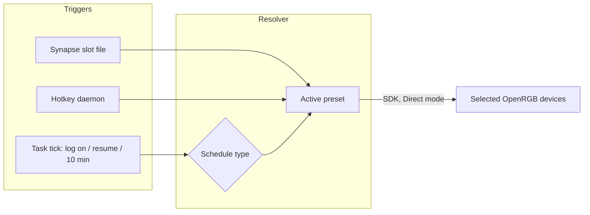

# Ultra Vivid

*(formerly Auto OpenRGB)*

Automatic RGB lighting scheduling for Windows. Color presets are applied to selected OpenRGB devices by rules — hours, days of the week, days of the month, months, or the actual daylight arc (solar-computed sunrise/twilight/night) — plus keyboard shortcuts, all driven by one config file and one Task Scheduler task.

## 📋 Table of Contents

- [How It Works](#how-it-works)
- [File Structure](#file-structure)
- [Getting Started](#getting-started)
- [Configuration](#configuration)
- [Keyboard Shortcuts](#keyboard-shortcuts)
- [Troubleshooting](#troubleshooting)
- [Documentation](#documentation)

---

<a id="how-it-works"></a>

## ⚡ How It Works

**Compute, don't generate:** there are no saved OpenRGB profiles and no per-combination scripts. One resolver computes the active color for any moment from the rules in `config.json` and applies it through the OpenRGB SDK server — only to the devices you selected (e.g. skipping a Razer keyboard that Synapse controls).



The tick stores its last decision and skips applying when nothing changed, so the 10-minute cadence costs nothing — it exists for minute-precision daylight boundaries.

---

<a id="file-structure"></a>

## 📁 File Structure

```
📁 Ultra Vivid/
  ⚙️ config.json         ← All presets, rules, devices, shortcuts (schema v2)
  🐍 resolver.py         ← The engine entry point
  🐍 hotkey_daemon.py    ← Resident: global hotkeys + optional Chroma
  🔧 install-task.ps1    ← Run once: tasks + startup server script
  📁 core/               ← Engine: settings, solar, schedule, apply, keymap, chroma
  📁 gui/                ← Control panel (PySide6): python -m gui.app
  📁 shortcuts/          ← Stable slot files for Synapse bindings (generated)
  📁 tests/              ← Golden tests for schedule semantics
  📁 setup/              ← Build pipeline (installer)
  📝 README.md, CLAUDE.md, version.py
```

---

<a id="getting-started"></a>

## 🚀 Getting Started

1. OpenRGB with the SDK server runs at startup (`OpenRGB-Server.vbs` in `shell:startup`, `--server --startminimized`).
2. Install dependencies and register the task:

```powershell
cd "U:\Coding\UVuruna\Gadgets\Ultra Vivid"
pip install -r requirements.txt
.\install-task.ps1
```

3. Configure through the GUI (or edit `config.json` directly):

```powershell
python -m gui.app
```

4. Verify:

```powershell
python resolver.py --dry-run        # what would be applied right now
python resolver.py --list-devices   # devices as OpenRGB reports them
python -m pytest tests              # schedule semantics golden tests
```

---

<a id="configuration"></a>

## ⚙️ Configuration

Everything lives in `config.json` (schema v2). Full field reference: [Settings](core/settings.md).

- **`colorPresets`** — named colors (`{"cyan": ["00FFFF"]}`); a preset with N colors distributes them round-robin across the selected devices.
- **`devices`** — `{"mode": "exclude", "names": ["Razer"]}`: substring match, case-insensitive; `include` mode selects only the named ones.
- **`schedule.type`** — exactly ONE grouping per schedule:

| Type | Rule |
|------|------|
| `hours` | `from`–`to` slots (to exclusive, wraps midnight); **uncovered hours = all RGB off** |
| `weekdays` | all 7 days get a preset |
| `monthdays` | day groups `from`–`to` inclusive (1–5, 5–10, …) |
| `months` | all 12 months get a preset |
| `daylight` | N day presets over the real sunrise→sunset arc (centered on solar noon), optional civil-twilight preset, optional night presets; no night list = off at night |

`daylight` needs `location` (latitude/longitude/timezone) — solar events are computed locally, no internet involved. Semantics detail: [Schedule](core/schedule.md).

---

<a id="keyboard-shortcuts"></a>

## ⌨️ Keyboard Shortcuts

A shortcut **set** is created in the GUI: name it (e.g. "DUGA") → pick a selector (shift / ctrl / alt / combos / **hypershift** — offered only when a Razer keyboard is detected) → pick ANY keys (letters, number row, numpad, F-keys — free mix) → pick a color preset per key → **Create shortcut files**.

- Every set gets its own folder `shortcuts/<SetName>/` with one VBS per key.
- **Standard selectors**: the resident daemon registers the hotkeys itself within seconds — nothing manual ([Hotkey Daemon](hotkey_daemon.md)).
- **Razer Hypershift** (no automation API exists): the GUI opens the set's folder and Razer Synapse with a step-by-step guide — link each key's file to a Synapse LAUNCH binding ONCE; re-mapping colors later is a pure config change. See [Shortcuts (folder)](shortcuts/__index.md).
- **Chroma module** (optional): the daemon can color the Razer keyboard through the Chroma REST API while Synapse keeps all key bindings — see [Chroma](core/chroma.md).

---

<a id="troubleshooting"></a>

## 🔧 Troubleshooting

| Symptom | Check |
|---------|-------|
| No colors at boot | Is `OpenRGB-Server.vbs` in `shell:startup`? The resolver retries for 60 s while the server starts |
| Wrong color | `python resolver.py --dry-run` shows the decision; `logs/resolver.log` shows what was applied |
| Nothing applies | `python resolver.py --list-devices` — is the SDK server reachable on 6742? |
| Config rejected | The error names the exact field; the resolver refuses to half-run a broken config |

---

<a id="documentation"></a>

## 📚 Documentation

| Area | Doc |
|------|-----|
| Engine | [Core (folder)](core/__index.md) → [Settings](core/settings.md), [Solar](core/solar.md), [Schedule](core/schedule.md), [Apply](core/apply.md), [Keymap](core/keymap.md), [Chroma](core/chroma.md) |
| Entry point | [Resolver](resolver.md) |
| Daemon | [Hotkey Daemon](hotkey_daemon.md) |
| Scheduled tasks | [Install Task](install-task.md) |
| Synapse slots | [Shortcuts (folder)](shortcuts/__index.md) |
| Control panel | [GUI (folder)](gui/__index.md) |
| Build pipeline | [Setup (folder)](setup/__setup.md) |
| AI guidance | [CLAUDE.md](CLAUDE.md) |
